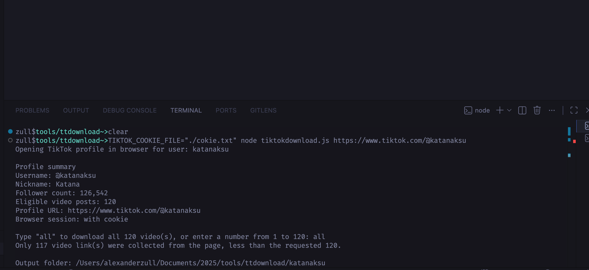
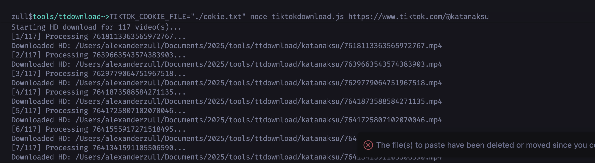
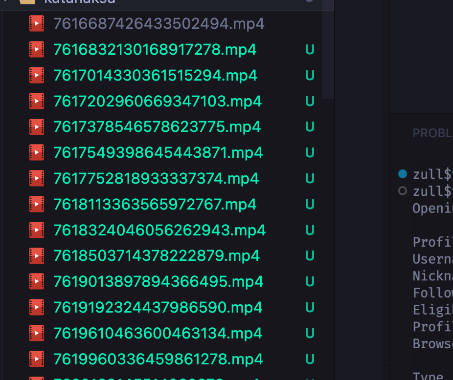

# TikTok HD Downloader



A simple CLI tool for downloading TikTok profile videos in HD using browser automation, login cookies, and an interactive terminal flow. The tool opens the target profile, shows an account summary, counts the available videos, and lets you choose whether to download all videos or only the latest `N` videos.

Additional preview:




## Requirement

- Node.js 20+ or a version with built-in `fetch`
- `npm`
- Google Chrome installed on macOS
- A logged-in TikTok account and a cookie header string for profile access
- A stable internet connection

## Tutorial Install

1. Clone the repository and move into the project folder.

```bash
git clone <repo-url>
cd ttdownload
```

2. Install dependencies.

```bash
npm install
```

3. Create a cookie file, for example `cokie.txt`, then paste your TikTok cookie header string into that file.

Example file content:

```txt
sessionid=xxx; sid_guard=yyy; tt_csrf_token=zzz
```

Need a step-by-step cookie export tutorial with Cookie-Editor? See [doc/cokie.md](doc/cokie.md).

4. Run the tool with the TikTok username you want to download from.

```bash
TIKTOK_COOKIE_FILE="./cokie.txt" node tiktokdownload.js @exampleuser
```

You can also pass a full profile URL:

```bash
TIKTOK_COOKIE_FILE="./cokie.txt" node tiktokdownload.js https://www.tiktok.com/@exampleuser
```

5. After the profile summary appears, choose one of the following:

- type `all` to download every available video
- type a number such as `5` to download the latest 5 videos

6. Downloaded files will be saved into a folder named after the target username.

Example:

```bash
./exampleuser/
```

Optional:

- Run the browser without opening a visible window:

```bash
TIKTOK_HEADLESS=1 TIKTOK_COOKIE_FILE="./cokie.txt" node tiktokdownload.js @exampleuser
```

- If your Chrome path is different:

```bash
CHROME_EXECUTABLE_PATH="/path/to/Google Chrome" TIKTOK_COOKIE_FILE="./cokie.txt" node tiktokdownload.js @exampleuser
```

## Roadmap

- Add resume support when a download stops midway
- Add filters for date range or maximum video count
- Add a more detailed batch progress summary
- Add metadata export to JSON or CSV
- Add multi-profile download support

## How to Contribute

1. Fork this repository.
2. Create a new branch for your changes.

```bash
git checkout -b feat/nama-perubahan
```

3. Make your changes and test the CLI flow locally.
4. Commit with a clear message.
5. Push your branch and open a pull request.

The most helpful contributions for this project include:

- improvements to TikTok profile scraping selectors
- better browser automation stability
- download batch optimization
- clearer documentation and usage tutorials

## License

This project is licensed under the [MIT License](LICENSE).

Made with love by `alexanderzul`.
